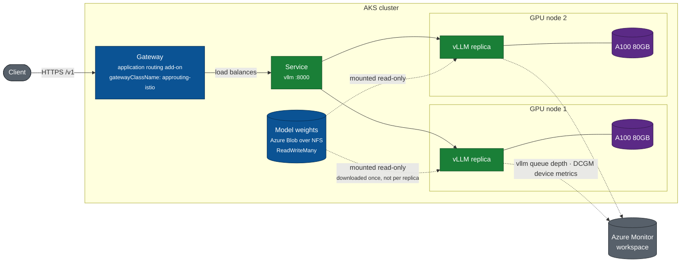

# Running an LLM inference service on AKS GPUs

This lab builds a working GPU inference service on Azure Kubernetes Service and
the operational surface around it: capacity that is verified before anything is
deployed, telemetry that shows whether the GPU is doing useful work, and a
scaling path beyond a single node.

The service is the destination. Every module before it exists because the
service needs it.



Each element exists for a reason the modules work through:

- **Gateway** terminates client traffic and load balances across replicas.
  Timeouts and TLS belong here, not in the model server. Module 7.
- **Two replicas on separate nodes** mean losing a node degrades capacity
  instead of ending the service. Module 6.
- **Shared model storage** over `ReadWriteMany` means the weights are downloaded
  once rather than once per replica, and a rescheduled pod remounts instead of
  re-downloading. Module 5.
- **Two metric streams** answer different questions. DCGM reports what the
  device is doing; vLLM reports what the service is doing. Module 4.

Not shown: the NVIDIA driver, device plugin, and DCGM exporter that AKS installs
and maintains on each GPU node. Module 2 covers those.

DCGM (NVIDIA Data Center GPU Manager) is NVIDIA's GPU monitoring daemon;
`dcgm-exporter` publishes its metrics in Prometheus format on port `19400`.

## What you end up with

- A GPU node pool whose NVIDIA stack is installed and maintained by AKS.
- An OpenAI-compatible inference endpoint backed by vLLM.
- Two independent metric sources: device-level from DCGM, request-level from
  vLLM, and the means to tell which one is the constraint.
- A verified path to shard one model across multiple GPU nodes.

## What this is and is not

The lab builds a service with the operational properties a production deployment
needs: shared model storage, multiple replicas across nodes, a disruption
budget, a gateway with timeouts suited to generation, and two metric streams.

It stops short of a deployment you would put in front of users. What remains,
and where each is discussed:

| Gap | Status | Covered in |
|---|---|---|
| TLS and authentication | not configured; the listener is plain HTTP | [module 7](modules/07-gateway.md) |
| Rate limiting | absent; one client can fill every queue | [module 7](modules/07-gateway.md) |
| Model-aware routing | the gateway load balances, but does not route on KV-cache locality or queue depth | [module 8](modules/08-scaling.md) |
| Adding GPU capacity automatically | managed GPU node pools do not support the cluster autoscaler during preview | [module 8](modules/08-scaling.md) |
| Multi-region | single region, no failover | not covered |
| Model version rollout | a rolling update, with no traffic-splitting between versions | not covered |

Each is named where it becomes relevant rather than collected as a disclaimer.

## Prerequisites

You need:

- An Azure subscription, with `az login` completed and permission to create
  AKS clusters and GPU node pools.
- Azure CLI ≥ 2.85.0 and the `aks-preview` extension ≥ 19.0.0b29.
- `kubectl` (install with `az aks install-cli` if you do not have it).
- GPU quota for the NVIDIA GPU SKUs this lab uses: T4, A10, and A100 for
  modules 0-5, H100 for the capstone.

Run [Module 0 — Prerequisites](modules/00-prerequisites.md) first. It checks
all of the above automatically and reports exactly what is missing, at zero
cost.

## Modules

Each module supplies something the service needs. They run in order because
each depends on the one before it.

| # | Module | Why the service needs it | Time |
|---|---|---|---|
| 0 | [Prerequisites](modules/00-prerequisites.md) | Confirm the subscription can allocate the GPUs before spending anything | 5 min |
| 1 | [Cluster and add-ons](modules/01-cluster.md) | The cluster, plus the add-ons later modules depend on | 20 min |
| 2 | [GPU capacity](modules/02-managed-gpu-nodepool.md) | GPU nodes whose NVIDIA stack AKS installs and maintains | 10 min |
| 3 | [Verify the capacity](modules/03-verify.md) | Prove the GPUs are usable before deploying onto them | 5 min |
| 4 | [Observability](modules/04-observability.md) | The two metric streams used to operate the service | 15 min |
| 5 | [Model storage](modules/05-model-storage.md) | Weights on shared storage so replicas do not each download them | 20 min |
| 6 | [The inference service](modules/06-inference-service.md) | Two vLLM replicas with probes, spread, and a disruption budget | 30 min |
| 7 | [Ingress and routing](modules/07-gateway.md) | A gateway in front, with timeouts that suit generation | 20 min |
| 8 | [Scaling and its limits](modules/08-scaling.md) | Which signals track load, and why autoscaling helps less than expected | 15 min |
| 9 | [Capstone: multi-node](modules/09-capstone-multinode.md) | Shard one model across two H100 nodes (optional) | 1-2 h |

Modules 0–5 run in **westus2**. The capstone runs in **swedencentral** on a
separate cluster, because the H100 SKU it needs has quota there and not in
westus2. These regions and SKUs reflect where this lab's authoring
subscription had availability and quota, not a requirement of the lab itself.

To use your own subscription's region and SKUs instead, set the corresponding
environment variables before running the scripts, or edit the defaults in
[`scripts/lib.sh`](scripts/lib.sh): `LAB_LOCATION`, `LAB_SKU_T4`,
`LAB_SKU_A10`, `LAB_SKU_A100` for modules 0-5, and `CAP_LOCATION`, `CAP_SKU`
for the capstone. [Module 0](modules/00-prerequisites.md#the-two-gate-rule)
covers how to confirm a SKU is both available and has quota in a given region.

## Quick start

Runs modules 0-3: creates the cluster and a T4 GPU node pool, and verifies the
managed stack.

```bash
./scripts/preflight.sh                          # read-only; costs nothing
./scripts/10-create-cluster.sh
./scripts/20-add-managed-gpu-nodepool.sh t4
./scripts/30-verify-managed-stack.sh t4
```

Then for the inference module, adds an A100 node pool and deploys vLLM:

```bash
./scripts/20-add-managed-gpu-nodepool.sh a100
./scripts/50-deploy-vllm.sh
```

## Cost

GPU nodes are the entire cost of this lab. **Run teardown when you stop.**

```bash
./scripts/90-teardown.sh --gpu-only   # drop GPU pools, keep the cluster
./scripts/90-teardown.sh              # delete everything
```

The T4 modules are cheap enough to repeat freely. The A100 inference module is
several times that. The capstone costs far more than the rest of the lab
combined and is opt-in.

## Validation status

Every module was executed against a live Azure subscription. This table records
what was verified and what was not.

| Module | Status | Evidence |
|---|---|---|
| 0 Prerequisites | **Verified** | preflight exits 0 against a live subscription |
| 1 Cluster and add-ons | **Verified** | Blob CSI, KEDA, Azure Monitor metrics, workload identity and the Gateway API implementation all report enabled |
| 2 GPU capacity | **Verified** | `gpuProfile` returned `driver=Install, managementMode=Managed`; nodes report `nvidia.com/gpu: 1` and the `dcgm-exporter` label |
| 3 Verify the capacity | **Verified** | six checks pass, including a container that reaches the GPU |
| 4 Observability | **Verified** | DCGM on `:19400`; field sets measured across four SKUs |
| 5 Model storage | **Verified** | `ReadWriteMany` PVC Bound; staging verified 4 shards, 14.2 GiB, and reclaimed 14.4 GiB of duplicate cache |
| 6 The inference service | **Verified** | two replicas Ready on separate nodes, loading from the shared volume rather than downloading |
| 7 Ingress and routing | **Verified** | Gateway programmed with an external address; 10 requests returned HTTP 200, distributed 6/5 across replicas |
| 8 Scaling and its limits | **Verified** | replicas beyond available GPUs stay `Pending` with `Insufficient nvidia.com/gpu`, as described |
| 9 Capstone: multi-node | **Partially verified** | serving path verified on one H100 node. Cross-node sharding and NCCL over InfiniBand **not** verified: a second H100 would not allocate |

Treat anything not marked verified as untested.

### Faults encountered while validating

These are recorded because each cost real time and none announced itself. Full
detail is in [`docs/accuracy.md`](docs/accuracy.md).

| Fault | How it presented |
|---|---|
| Blob CSI `mountOptions` with a leading `-o` | pods stuck in `ContainerCreating` |
| Staging job skipping on a non-empty directory | job succeeded with zero weight shards present |
| Download cache duplicated on NFS | 29 GiB consumed for a 15 GiB model |
| A GPU node that could not allocate its GPU | every health signal green; no container could start |
| A crashlooping pod holding a GPU | new replicas `Pending` while the GPU appeared free |
| `az aks update` racing another operation | exit 0, no error, change not applied |
| `az aks approuting enable` | enabled NGINX, not the Gateway API implementation |

## Layout

```
scripts/     numbered, idempotent, safe to re-run
manifests/   Kubernetes YAML applied by the scripts
modules/     the written walkthrough, one file per module
docs/        citations, version floors, and behaviour observed while validating
```

### Keeping the diagrams accurate

The architecture diagrams are Mermaid source in `README.md` and
[module 6](modules/09-capstone-multinode.md), rendered by GitHub. They are text,
so they diff and review like the rest of the repo.

`scripts/check-diagrams.sh` guards them. It confirms every Mermaid block still
renders, and cross-checks the facts a diagram asserts against the files that
implement them: the DCGM port, the GPU resource name, the managed GPU flag, the
capstone SKU, and the Ray Serve port. Changing a port or a SKU in a manifest
without updating the diagram fails the check.

Run it after changing any manifest, node pool SKU, port, or resource name:

```bash
./scripts/check-diagrams.sh
```

To extend it, add a row to the table at the bottom of that script:
`description|string the diagram asserts|file that must also contain it`.

Configuration lives in `scripts/lib.sh` and is overridable by environment
variable: `LAB_LOCATION`, `LAB_RG`, `LAB_CLUSTER`, and the SKU names.
