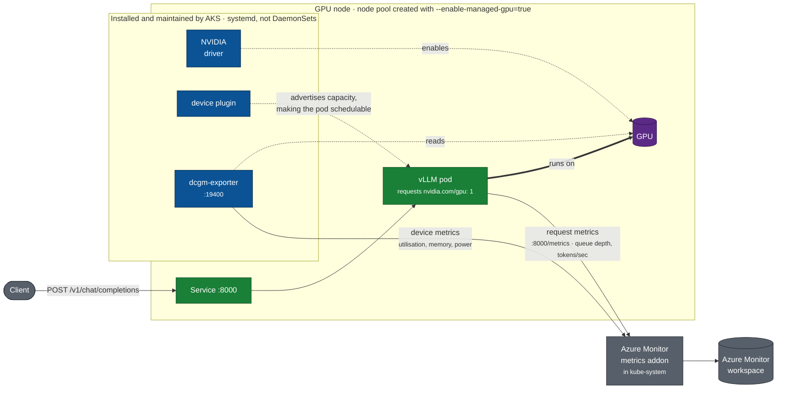

# Running an LLM inference service on AKS GPUs

This lab builds a working GPU inference service on Azure Kubernetes Service and
the operational surface around it: capacity that is verified before anything is
deployed, telemetry that shows whether the GPU is doing useful work, and a
scaling path beyond a single node.

The service is the destination. Every module before it exists because the
service needs it.



The blue components are what `--enable-managed-gpu=true` buys. AKS installs and
maintains the NVIDIA driver, the Kubernetes device plugin, and the DCGM metrics
exporter on every node in the pool. They run as systemd services on the node
rather than as DaemonSets, so `kubectl get daemonset` does not list them.

The two metrics paths on the right stay separate on purpose. DCGM reports what
the device is doing; vLLM reports what the service is doing. Module 4 covers
why comparing them is how you find the bottleneck.

DCGM (NVIDIA Data Center GPU Manager) is NVIDIA's GPU monitoring daemon;
`dcgm-exporter` publishes its metrics in Prometheus format on port `19400`.

## What you end up with

- A GPU node pool whose NVIDIA stack is installed and maintained by AKS.
- An OpenAI-compatible inference endpoint backed by vLLM.
- Two independent metric sources: device-level from DCGM, request-level from
  vLLM, and the means to tell which one is the constraint.
- A verified path to shard one model across multiple GPU nodes.

## What this is not

The lab runs a real service, not a production deployment. Before running
anything like this for users, you would need at least:

| Gap | What the lab does | What production needs |
|---|---|---|
| Availability | one replica, one node | multiple replicas across nodes or zones |
| Model storage | `emptyDir`, re-downloaded on every reschedule | a PersistentVolume or an image with weights baked in |
| Scaling | manual `az aks nodepool scale` | autoscaling, which managed GPU node pools do not support during preview |
| Ingress | `ClusterIP`, reachable only inside the cluster | ingress with TLS and authentication |
| Model lifecycle | one pinned model | versioned rollout and rollback |

Each is called out in the module where it becomes relevant.

> **Preview.** The managed GPU experience is in preview. The field behind it,
> `gpuProfile.nvidia.managementMode`, exists only on preview API versions, so the
> `aks-preview` CLI extension is required. See
> [`docs/accuracy.md`](docs/accuracy.md#why-this-lab-is-on-the-preview-surface).

## Prerequisites

You need:

- An Azure subscription, with `az login` completed and permission to create
  AKS clusters and GPU node pools.
- Azure CLI ≥ 2.85.0 and the `aks-preview` extension ≥ 19.0.0b29.
- `kubectl` (install with `az aks install-cli` if you do not have it).
- GPU quota for the NVIDIA GPU SKUs this lab uses: T4, A10, and A100 for
  modules 0-5, H100 for the capstone.

Run [Module 0 — Prerequisites](modules/00-prerequisites.md) first. It checks
all of the above automatically and reports exactly what is missing, at zero
cost.

## Modules

Each module supplies something the service needs. They run in order because
each depends on the one before it.

| # | Module | Why the service needs it | Time |
|---|---|---|---|
| 0 | [Prerequisites](modules/00-prerequisites.md) | Confirm the subscription can allocate the GPUs before spending anything | 5 min |
| 1 | [Cluster](modules/01-cluster.md) | The cluster to run on, with GPU capacity kept in its own pool | 10 min |
| 2 | [GPU capacity](modules/02-managed-gpu-nodepool.md) | GPU nodes whose NVIDIA stack AKS installs and maintains | 10 min |
| 3 | [Verify the capacity](modules/03-verify.md) | Prove the GPUs are usable before deploying onto them | 5 min |
| 4 | [Observability](modules/04-observability.md) | The two metric sources used to operate the service | 15 min |
| 5 | [The inference service](modules/05-inference-vllm.md) | vLLM behind an OpenAI-compatible endpoint | 30 min |
| 6 | [Scaling past one node](modules/06-capstone-multinode.md) | Shard one model across two H100 nodes (optional) | 1-2 h |

Modules 0–5 run in **westus2**. The capstone runs in **swedencentral** on a
separate cluster, because the H100 SKU it needs has quota there and not in
westus2. These regions and SKUs reflect where this lab's authoring
subscription had availability and quota, not a requirement of the lab itself.

To use your own subscription's region and SKUs instead, set the corresponding
environment variables before running the scripts, or edit the defaults in
[`scripts/lib.sh`](scripts/lib.sh): `LAB_LOCATION`, `LAB_SKU_T4`,
`LAB_SKU_A10`, `LAB_SKU_A100` for modules 0-5, and `CAP_LOCATION`, `CAP_SKU`
for the capstone. [Module 0](modules/00-prerequisites.md#the-two-gate-rule)
covers how to confirm a SKU is both available and has quota in a given region.

## Quick start

Runs modules 0-3: creates the cluster and a T4 GPU node pool, and verifies the
managed stack.

```bash
./scripts/preflight.sh                          # read-only; costs nothing
./scripts/10-create-cluster.sh
./scripts/20-add-managed-gpu-nodepool.sh t4
./scripts/30-verify-managed-stack.sh t4
```

Then for the inference module, adds an A100 node pool and deploys vLLM:

```bash
./scripts/20-add-managed-gpu-nodepool.sh a100
./scripts/50-deploy-vllm.sh
```

## Cost

GPU nodes are the entire cost of this lab. **Run teardown when you stop.**

```bash
./scripts/90-teardown.sh --gpu-only   # drop GPU pools, keep the cluster
./scripts/90-teardown.sh              # delete everything
```

The T4 modules are cheap enough to repeat freely. The A100 inference module is
several times that. The capstone costs far more than the rest of the lab
combined and is opt-in.

## Validation status

Every module's commands have been run against a live Azure subscription. The
table records the result for each module, including what remains unverified.

| Module | Status | Evidence |
|---|---|---|
| 0 Prerequisites | **Verified** | preflight exits 0; az 2.90.0, aks-preview 19.0.0b29, feature Registered |
| 1 Cluster | **Verified** | cluster created in westus2, k8s 1.35.7, 2 system nodes Ready |
| 2 Managed GPU node pool | **Verified** | `gpuProfile` returned `driver=Install, managementMode=Managed` on T4, A10 and A100 pools |
| 3 Verify the stack | **Verified** | 5 of 6 checks PASS; check 4 WARNs by design (see D6) |
| 4 Runtime telemetry | **Verified** | DCGM live on `:19400`; field sets measured across A10 vGPU (11), T4 (20), A100 (23), H100 (24) |
| 5 Serve a model | **Verified** | vLLM v0.28.0 on A100 served `'GPU lab online.'`; 12334 tokens generated under a 12-request load |
| 6 Capstone | **Partially verified** | End-to-end on **one** H100 node: managed GPU stack, KubeRay 1.6.1, RayService + Ray Serve LLM, vLLM via Ray placement groups, real inference returned. Required starting `nvidia-fabricmanager` by hand first (see D7). **Cross-node sharding (PP=2) and NCCL-over-InfiniBand NOT verified**: a second H100 would not allocate (`AllocationFailed`, capacity) |

Treat anything marked **not verified** as untested.

## Layout

```
scripts/     numbered, idempotent, safe to re-run
manifests/   Kubernetes YAML applied by the scripts
modules/     the written walkthrough, one file per module
docs/        citations, version floors, and behaviour observed while validating
```

### Keeping the diagrams accurate

The architecture diagrams are Mermaid source in `README.md` and
[module 6](modules/06-capstone-multinode.md), rendered by GitHub. They are text,
so they diff and review like the rest of the repo.

`scripts/check-diagrams.sh` guards them. It confirms every Mermaid block still
renders, and cross-checks the facts a diagram asserts against the files that
implement them: the DCGM port, the GPU resource name, the managed GPU flag, the
capstone SKU, and the Ray Serve port. Changing a port or a SKU in a manifest
without updating the diagram fails the check.

Run it after changing any manifest, node pool SKU, port, or resource name:

```bash
./scripts/check-diagrams.sh
```

To extend it, add a row to the table at the bottom of that script:
`description|string the diagram asserts|file that must also contain it`.

Configuration lives in `scripts/lib.sh` and is overridable by environment
variable: `LAB_LOCATION`, `LAB_RG`, `LAB_CLUSTER`, and the SKU names.
