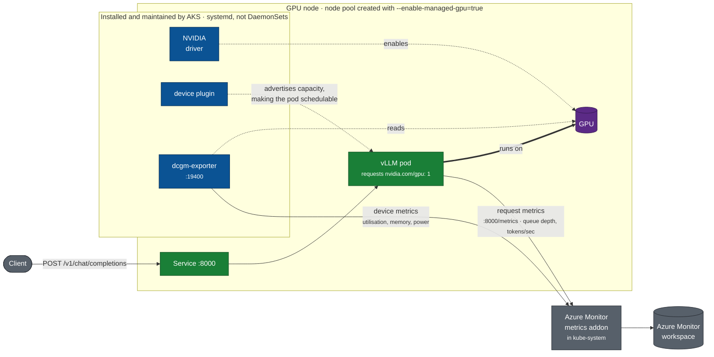

# Module 2 — The managed GPU node pool

```bash
./scripts/20-add-managed-gpu-nodepool.sh t4
```

Roughly 5–10 minutes. Slower than a CPU node pool because the driver and the
managed components install at node provisioning time.

This creates one running GPU node, which is the cost of this module. Run
`./scripts/90-teardown.sh --gpu-only` to delete GPU node pools and keep the
cluster, or `./scripts/90-teardown.sh` to delete everything; see the
[repo README](../README.md#cost) for cost guidance.

## Enable the managed stack

```bash
az aks nodepool add \
  --resource-group "$LAB_RG" \
  --cluster-name "$LAB_CLUSTER" \
  --name gpunp \
  --node-count 1 \
  --node-vm-size Standard_NC4as_T4_v3 \
  --node-taints sku=gpu:NoSchedule \
  --enable-managed-gpu=true
```

`--enable-managed-gpu=true` sets `gpuProfile.nvidia.managementMode = Managed`,
and AKS takes ownership of three components:

| Component | What it does |
|---|---|
| NVIDIA GPU driver | kernel modules and user-space libraries |
| NVIDIA device plugin | advertises `nvidia.com/gpu` to the kubelet |
| DCGM (NVIDIA Data Center GPU Manager) + dcgm-exporter | GPU metrics on port `19400` |

### Resource group, cluster, node pool name, and SKU

`$LAB_RG` and `$LAB_CLUSTER` are the same resource group and cluster created
in [Module 1](01-cluster.md). The node pool name (`gpunp`) and SKU
(`Standard_NC4as_T4_v3`) come from `LAB_NODEPOOL_T4` and `LAB_SKU_T4` in
`scripts/lib.sh`. See
[Adapt region and SKU to your subscription](00-prerequisites.md#adapt-region-and-sku-to-your-subscription)
in Module 0 for how to override any of these and confirm a substitute SKU
clears both quota gates in your own subscription and region.

## What lands on the node



The three blue components are what the flag installs. They run as systemd
services on the node, not as DaemonSets, so `kubectl get daemonset` does not
list them. Module 3 verifies each one.

## The flag is not optional

Omitting `--enable-managed-gpu` does not select the full managed stack. The
default is driver-only: AKS installs the driver and nothing else,
`nvidia.com/gpu` never appears on the node because no device plugin is
installed, and no GPU pod can be scheduled.

Combined with immutability below, that makes the flag the single most
consequential part of this command. AKS supports two other install profiles,
including bringing your own driver for use with the NVIDIA GPU Operator; see
[accuracy notes](../docs/accuracy.md#the-three-install-profiles) and
[Use NVIDIA GPUs on AKS](https://learn.microsoft.com/azure/aks/use-nvidia-gpu).

## Immutability

`gpuProfile.nvidia.managementMode`, `migStrategy`, and `driver` are all fixed
at node pool creation and cannot be changed afterward. There is no
`az aks nodepool update` path back: choosing the wrong profile means deleting
the node pool and creating it again with the correct flags.

`scripts/20-add-managed-gpu-nodepool.sh` checks for an existing node pool with
the same name and exits without changing anything if one is found, rather
than attempting to reconfigure it.

## The GPU taint is not automatic

AKS does not taint GPU nodes by default. `sku=gpu:NoSchedule` in the command
above is a convention from the AKS documentation, applied explicitly with
`--node-taints`.

The taint keeps CPU workloads off the more expensive GPU nodes. It also means
every GPU pod needs a matching toleration. A pod without one stays `Pending`;
run `kubectl describe pod <name>` and check the `Events` section, which names
the untolerated taint under `FailedScheduling`.

## Automatic driver selection

`gpuProfile.driverType` is empty by default: AKS selects the driver based on
system compatibility. Creating both node pools in this lab and comparing them
shows that choice in practice:

| Pool | SKU | Driver | CUDA | Device reported |
|---|---|---|---|---|
| `gpunp` | `Standard_NC4as_T4_v3` | 580.159.04 | 13.0 | `Tesla T4` |
| `infnp` | `Standard_NV36ads_A10_v5` | 570.211.01 | 12.8 | `NVIDIA A10-24Q` |

The `-24Q` suffix marks a GRID **vGPU** (virtual GPU) profile. NC-series is
the compute family and gets the datacenter CUDA driver; NV-series is the
visualization family and gets the GRID driver. AKS selects the driver branch
per family, so the two pools end up on different driver branches and
different CUDA versions in the same cluster.

This matters when pinning a container image: an image built against CUDA 13
will not necessarily behave the same on the CUDA 12.8 GRID node.
`--driver-type` accepts `GRID` or `CUDA` and is immutable after creation, but
it applies only to Windows GPU node pools. There is no CLI override for
Linux, so this choice cannot be forced here.

## Confirm the profile was applied

```bash
az aks nodepool show -g "$LAB_RG" --cluster-name "$LAB_CLUSTER" -n gpunp --query gpuProfile
```

```json
{
  "driver": "Install",
  "driverType": "",
  "nvidia": { "managementMode": "Managed", "migStrategy": null }
}
```

`migStrategy` controls Multi-Instance GPU (MIG) partitioning and is not used
by this module; `null` is expected here.

If `nvidia` is `null`, the pool was created **without** the managed stack.
Delete it and recreate with the flag.

## Scaling

Managed GPU node pools do **not** support the cluster autoscaler during
preview. Scale manually:

```bash
az aks nodepool scale -g "$LAB_RG" --cluster-name "$LAB_CLUSTER" -n gpunp --node-count 2
```

This is why no module in this lab uses `--enable-cluster-autoscaler`.

## Next

[Module 3: Verify the capacity](03-verify.md)
